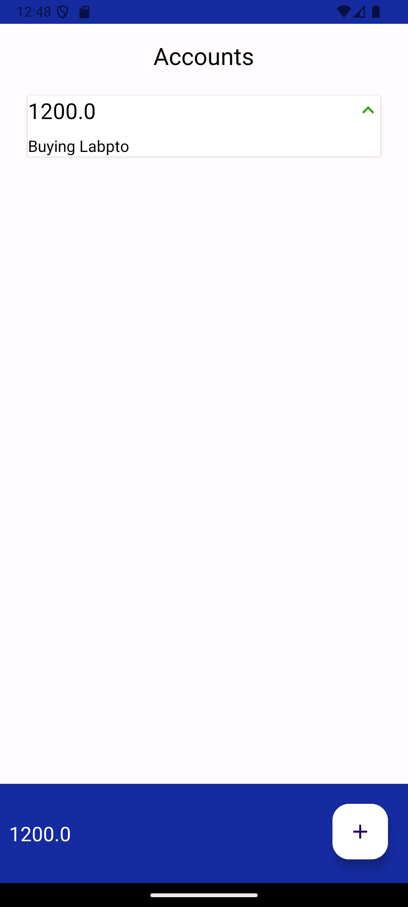

# 💰 AccountingApp

An Android application developed in **Java** using **SQLite** for managing personal finances. Users can **create an account**, **log in**, and **track financial transactions** — whether money is owed **by** or **to** them.

## 📱 Features

- 🔐 **User Authentication**  
  Sign up and log in securely to access your personal data.

- 💸 **Transaction Management**  
  Add entries with a description, amount, and define whether the money is yours (credit) or you owe it (debit).

- 🧠 **Local Database**  
  Data is stored locally using SQLite – ensuring offline availability.

- 🖼 **Simple & Intuitive UI**  
  Easy-to-use interface with clean screens to add/view transactions.

## 📷 Screenshots

| Login | Home | Add Transaction |
|-------|------|------------------|
|


 |

> Replace image paths with your actual screenshot paths (e.g., `screens/login.png`)

## 🧱 Technologies Used

- **Java** (Android SDK)
- **SQLite** (Local Database)
- **XML** (UI Layouts)

## 📦 Installation

1. Clone the repository:
   ```bash
   git clone https://github.com/your-username/AccountingApp.git
